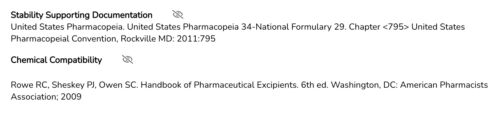

# 2025-01-29

## Enhancements

* Ingredients marked as “consumables” will now appear at the bottom of the ingredient list on the formula-level, within the “Create Lot” task, and on the worksheet.
* Added a “Fixed Quantity” checkbox for ingredients designated as consumables at the formula-level. Lab users can select this option and enter a fixed quantity, ensuring the quantity remains unchanged within the formula.

<figure><figcaption></figcaption></figure>

* Added timestamps for recorded weights, visible in the “Create Lot” task under instructions.

<figure><figcaption></figcaption></figure>

* Added the ability for users to create individual notes within the “Create Lot”  and "Pharmacist Check-Lot" task. Notes are now automatically separated by username and timestamp upon entry.

<figure><figcaption></figcaption></figure>

* The compounding worksheet will now include the **Stability Supporting Documentation** and **Chemical Compatibility** information.

<figure><figcaption></figcaption></figure>
