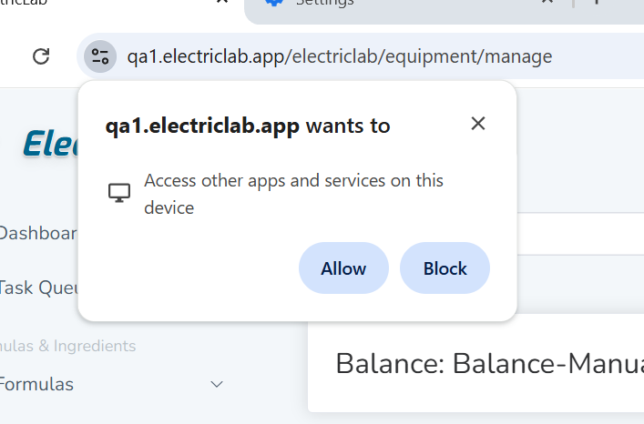

# Configuring a Scale for Direct USB Connection for Windows

On the sidebar, navigate to Configuration -> Configure Equipment

Add a new balance and select Direct Balance Connect as the type

Be sure to allow Electriclab to access the service

<figure><figcaption></figcaption></figure>

<figure><figcaption></figcaption></figure>

If you do not have the service installed, you will be prompted to download and install, it. Follow the instructions and download and install the service.

<figure><figcaption></figcaption></figure>

Once the service is installed you should be able to plug the balance in via a USB to Serial cable and select it in the dropdown.&#x20;

\
Most balances will default to 9600 baud, if you know your balance is set to a specific baud rate, select it in the dropdown, otherwise the service will attempt to autodetect the baud rate, but it will take longer to connect.
