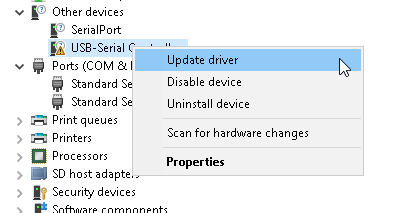

# Configuring a Scale for Direct USB for Windows

1. Open Device Manager through the Windows menu. This can be done by either by clicking the **Windows Button** > Search for Device Manager with Windows search (as seen in the screenshot below), or you can access the Device mManager through the Control pPanel (which is also accessed via the **Windows Button**).

<figure><figcaption></figcaption></figure>

2. Scroll down until you find ports as depicted in the image below (also open Other devices as it may not register as a **Port**).

<figure><figcaption></figcaption></figure>

3. Plug the scale in to your USB slot. If the device appears under **Ports** with an associated COM number as shown in the image above, then your device is ready to use. Note the COM number and then skip to Step 11.
4. If the device appears under **Other devices**, you must update the driver to function. It will look like this:

<figure><figcaption></figcaption></figure>

5. Right-click the newly-added device and select **Update Driver**.

<figure><figcaption></figcaption></figure>

6. Click **Browse my computer for drivers**.

<figure><figcaption></figcaption></figure>

7. Click **Let me pick from a list of available drivers**.

<figure><figcaption></figcaption></figure>

8. Scroll down in the box on the left until you find Microsoft. Select it and the box to the right shows available drivers. Select **USB Serial Device.** Then, click **Next**.

<figure><figcaption></figcaption></figure>

9. A warning message like the one below appears. Click **Yes** to continue past the warning.

<figure><figcaption></figcaption></figure>

10. In Device Manager, the device appears under the **Ports** Section. Note the COM number.
11. Try to connect the scale within your ElectricLab session. A window appears indicating for you to select a COM port number. Enter the one you noted down earlier. If it functions as expected, stop here and continue your workflow like normal[^1]. If it doesn't, return to step 5.

[^1]: In the future, as long as you reconnect the device to the same USB port, you will not need to re-do these steps again.
