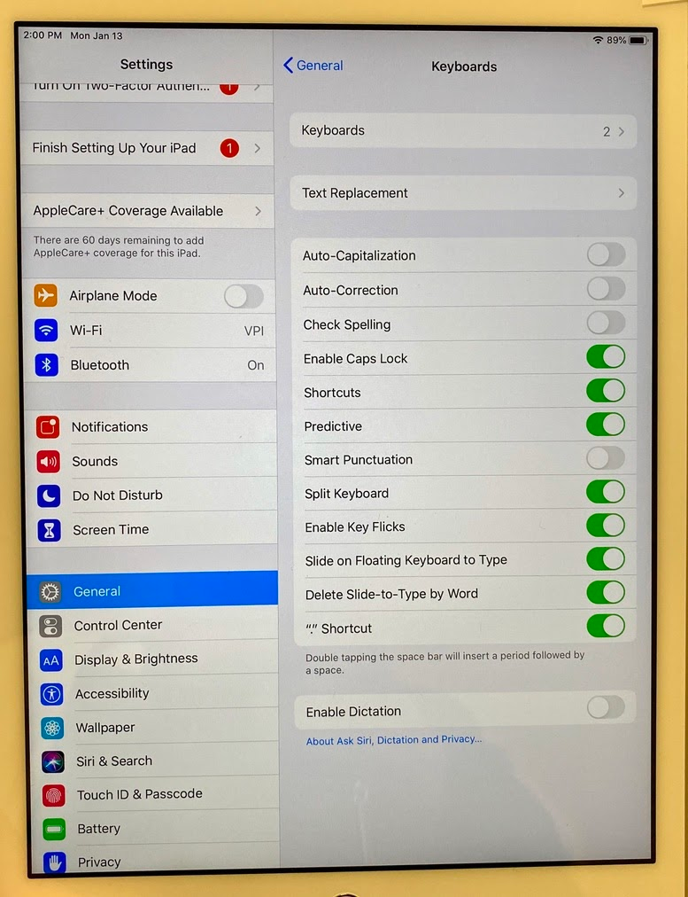
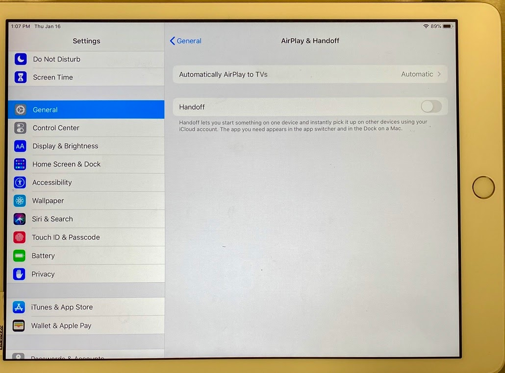

# iPad Settings for ElectricLab

Enter the device into Electric Lab under **Equipment**. Print and affix the 2D barcode to the tablet.

* **Note:** Each iPad needs to have a unique iCloud account.&#x20;

<figure><figcaption></figcaption></figure> <figure><figcaption></figcaption></figure>

* **Display & Brightness Settings:** Consider increasing the Auto-Lock time to 15 minutes so the iPad doesn’t turn off in the middle of a task.
* **Keyboard Settings:** Turn off **Auto-Capitalization, Auto-Correction, Check Spelling and Smart-Punctuation**. These may interfere with barcode scanning.
* **Handoff Settings:** Disable Handoff.
* **Software Update Settings:** Either manual or automatic update. Discuss which option might work best for your facility.
* **Safari Settings:** The **Request Desktop Website** setting should be disabled.
