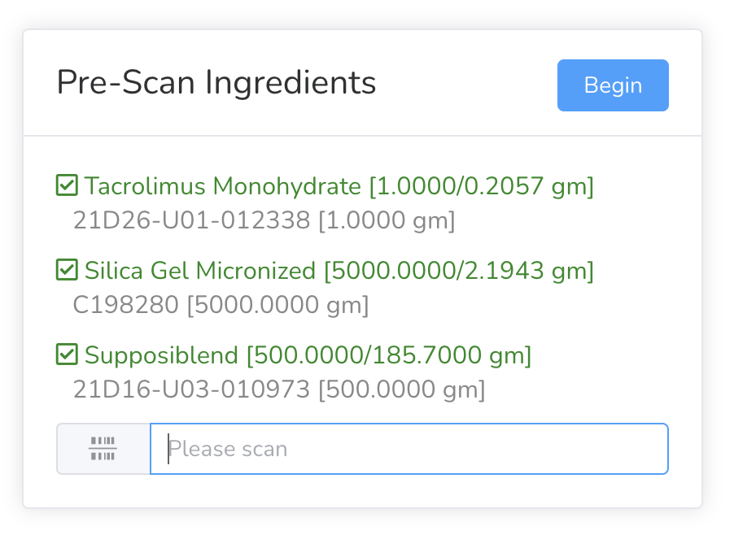
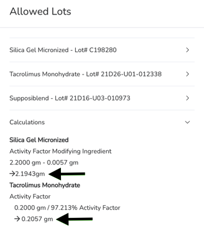

# Compounding with Activity Factor

Complete pre-scan of all ingredients that will be used for this batch.

<figure><figcaption></figcaption></figure>

After the pre-scan is complete, select **Begin**. Calculations are displayed on the compounding worksheet.

<figure><figcaption></figcaption></figure> <figure><figcaption></figcaption></figure>

In this example, Tacrolimus has an activity factor and Silica Gel is the “Activity Factor Modifying Ingredient.”

<figure><figcaption></figcaption></figure>

After the pre-scan step is completed, the quantity of Tacrolimus has increased while the quantity of silica gel has decreased to maintain the same total quantity of powder ingredients.

<figure><figcaption></figcaption></figure>
