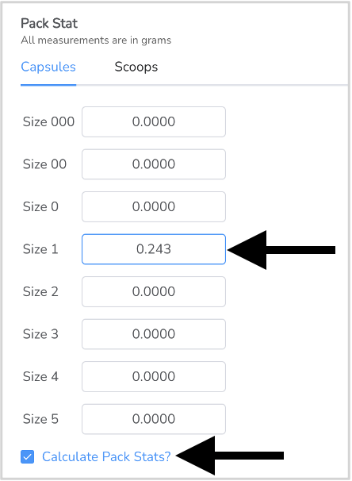
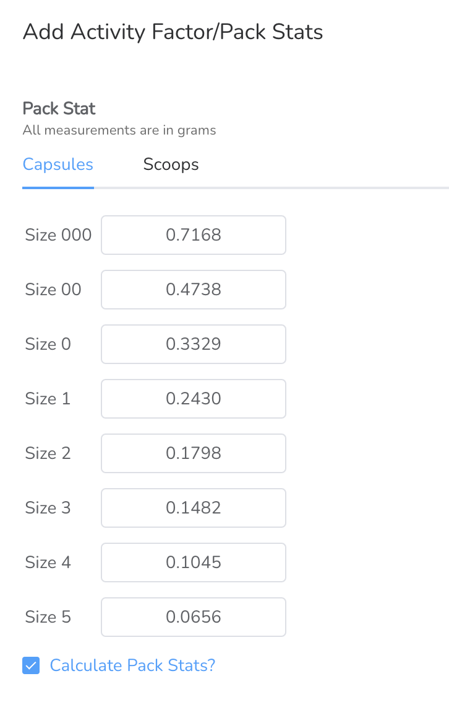

# Pack Stat Module

In the main ingredient entry, select the 'Has Pack Stat' option.

<figure><figcaption></figcaption></figure>

After the Ingredient lot has been accepted into inventory, add the pack stat in the ingredient entry by using the ingredient inventory search. Once added, the pack stat cannot be modified.

<figure><figcaption></figcaption></figure>

If you are using an ingredient for both capsules and scoops, enter the pack stat data for each. For capsules, just enter the pack stat for one capsule size and the system will extrapolate the other capsule sizes for you.

<figure><figcaption></figcaption></figure> <figure><figcaption></figcaption></figure>

On the master formula you will need to indicate 'Pack Stat Required' as well as the capsule/scoop size.

<figure><figcaption></figcaption></figure>

Determine the Excipient Ingredient to be modified. Note the blue capsule icon indicates the ingredient has the pack stat option set in the main ingredient entry. &#x20;

<figure><figcaption></figcaption></figure>
