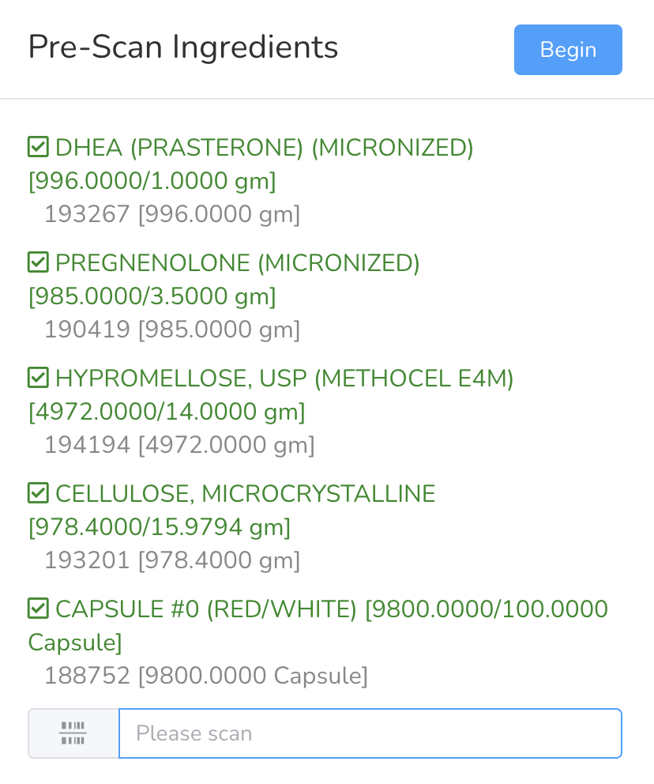
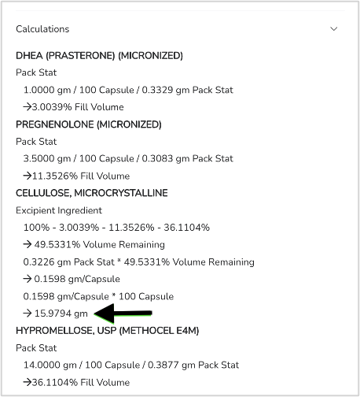

# Compounding With Pack Stats

Complete pre-scan of all ingredients that will be used for this batch.

<figure><figcaption></figcaption></figure>

After the pre-scan is complete, select **Begin**. Calculations are displayed on the compounding worksheet.

<figure><figcaption></figcaption></figure> <figure><figcaption></figcaption></figure>

In this example, Cellulose is designated as the pack stat excipient ingredient. Note below, the quantity shown for Cellulose prior to the pre-scan step will change after all ingredients are scanned for this batch.

<figure><figcaption></figcaption></figure>

After the pre-scan step is completed, the quantity of cellulose has been adjusted to fill the capsule.

<figure><figcaption></figcaption></figure>
