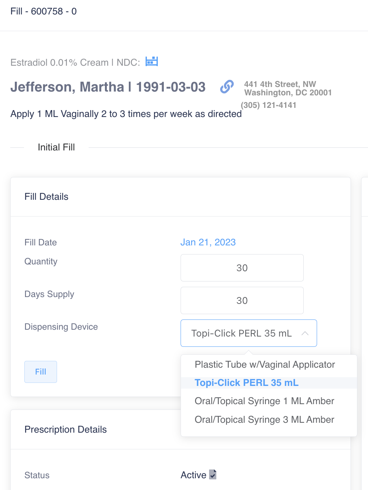
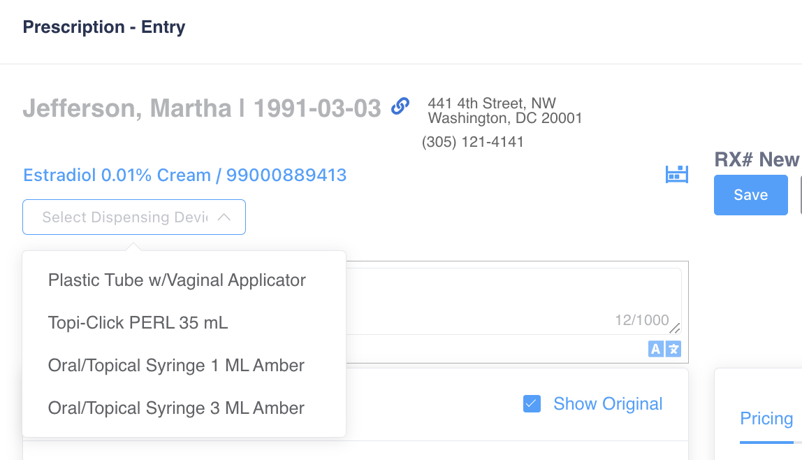

# Dispensing Devices

To add a list of dispensing devices, open the dispensing devices page under maintenance and click **Add New**. Users can also edit or delete an existing device by clicking **Edit** next to the dispensing device.

<figure><figcaption></figcaption></figure>

To associate specific dispensing devices with a particular formula, first open the product in the ION product manager and mark **Has Dispensing Device**.

<figure><figcaption></figcaption></figure>

<figure><figcaption></figcaption></figure>

Next, select any desired dispensing device(s) that you would like to associate with this formula.

* **Note:** All dispensing devices associated with the formula will be visible during the prescription entry process as well as throughout the process of filling and dispensing the prescription.

<figure><figcaption></figcaption></figure>

After selecting the desired dispensing devices, save the changes at the bottom of the page.

* **Note:** If a dispensing device is required upon fill, mark the **Require Dispensing Device on Fill**_._

<figure><figcaption></figcaption></figure>

During prescription entry, all dispensing devices associated with the formula will be available to select from.

<figure><figcaption></figcaption></figure> <figure><figcaption></figcaption></figure>

When a prescription is filled, initially or refilled, the dispensing device can be changed if desired.

Dispensing devices associated with a prescription fill can be displayed in the dispensing queue. To manage dispensing queue visible columns, click the gear icon and select all desired columns.
