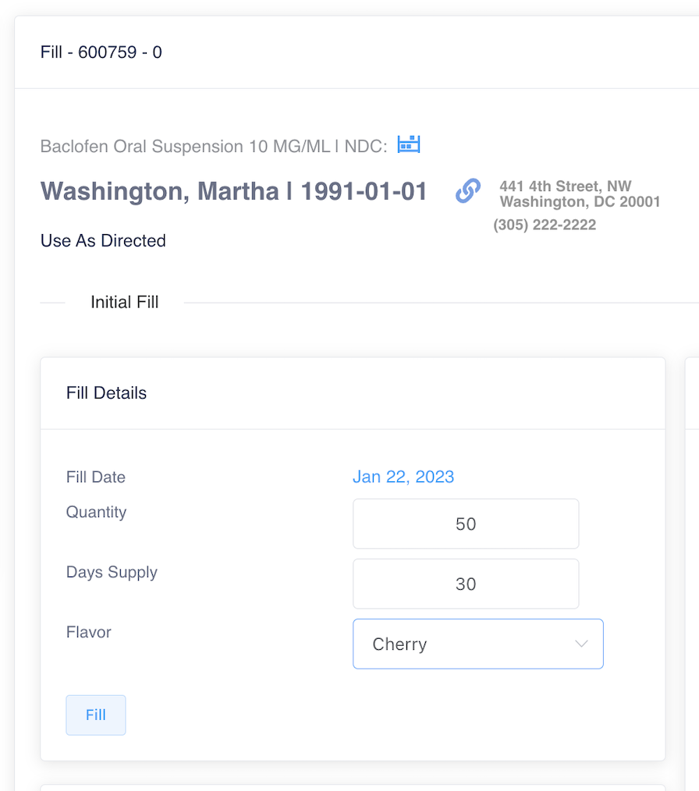
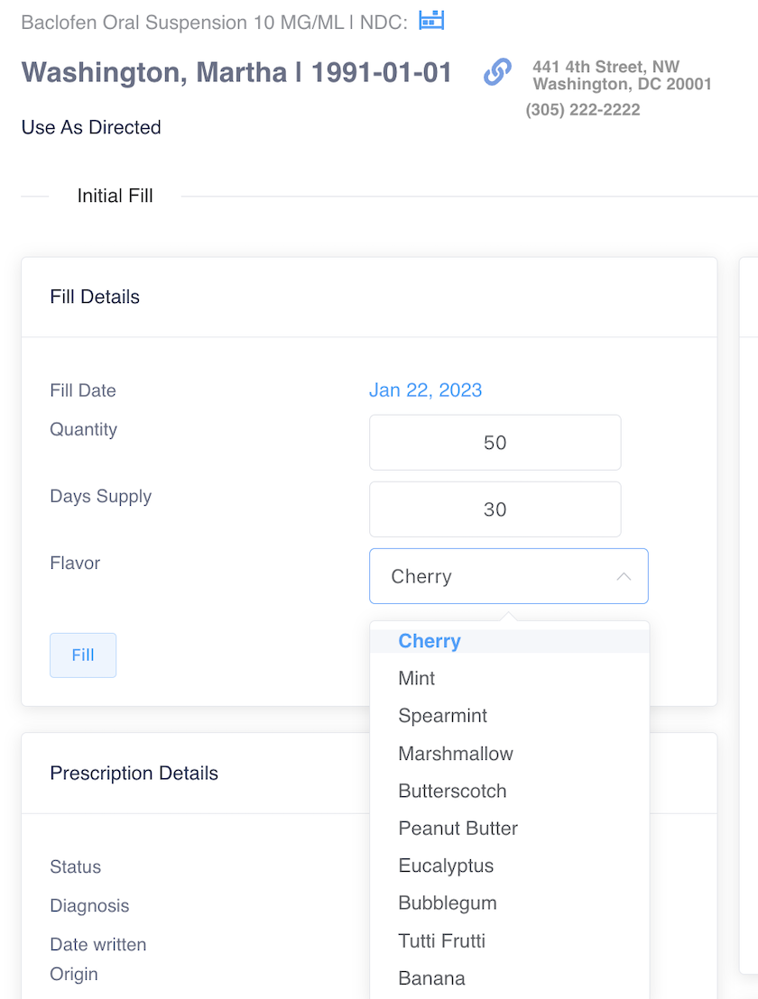

# Flavored Products

During prescription entry, when a product is selected that has a flavor ingredient, a dropdown will be available for the user to select the desired flavor.

<figure><figcaption></figcaption></figure>

When the prescription is filled, the pre-selected flavor will auto populate in the flavor field.

* **Note:** This flavor selection can be changed at the time a prescription is filled or refilled.

<figure><figcaption></figcaption></figure> <figure><figcaption></figcaption></figure>

The flavor will appear in the dispense queue under the product name.

<figure><figcaption></figcaption></figure>

After scanning the product lot, a flavor match verification will appear below the product code match verification.

<figure><figcaption></figcaption></figure>

The flavor will also appear on the prescription label.

<figure><figcaption></figcaption></figure>

The dispense record will show the flavor along with the Lot Number.

<figure><figcaption></figcaption></figure>

The prescription fill history will also contain the flavor dispensed for a particular fill.

<figure><figcaption></figcaption></figure>
