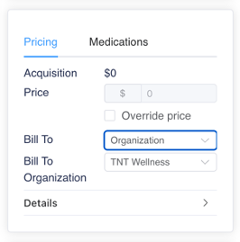
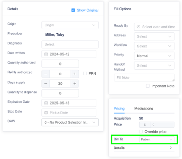

# Billing to Organizations

To have the option to choose to bill to an organization: open the desired organization line and activate **Enable Invoicing to Company** and click **Save** at the bottom.

<figure><figcaption></figcaption></figure>

The first 'Bill To' line will show patient by default, click on the drop-down menu to choose patient or organization. When choosing organization, and the corresponding organization name will auto populate on the next 'Bill To' line.

<figure><figcaption></figcaption></figure> <figure><figcaption></figcaption></figure>

To automatically set both 'Bill To' lines to organization and the organization linked with the prescriber, activate **Bill to Organization by Default** along with **Enable Invoicing to Company** and click **Save** at the bottom.

<figure><figcaption></figcaption></figure>

<figure><figcaption></figcaption></figure>

## Identifying Billing Organizations from Prescription Notes

If a prescriber writes prescriptions for multiple different external pharmacies, they might use the prescriber notes field to identify which organization should be billed for each prescription. ION can scan these notes and identify potential organizations for billing using key phrases you configure in the organization’s profile.

In the example below, a prescriber submits a prescription that should be billed to Happy Clinic, LLC. The prescriber notes the clinic name in the prescription notes. The profile for Happy Clinic, LLC is configured to identify the phrase “Happy Clinic” in the prescription notes. As a result, when the prescription is entered, the system uses Happy Clinic, LLC as the default billing organization.

<figure><figcaption></figcaption></figure>

To set up key phrases for a specific organization, complete these steps:

1. Open the organization’s profile (**Maintenance** > **Organizations** > select the organization).
2. In the **eRx Clinic Match Text** field, enter the word or phrase you want to search. This field is not case-sensitive and searches using the phrase entered instead of individual words. For example, if you enter “Happy Clinic,” the system searches for the words “happy clinic” in that order, not for the individual words “happy” and “clinic.”
3. Click **Save Organization** at the bottom of the page.

<figure><figcaption></figcaption></figure>
