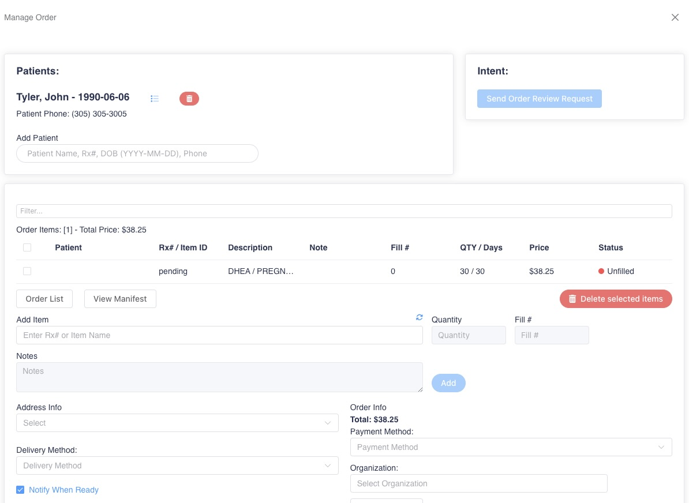
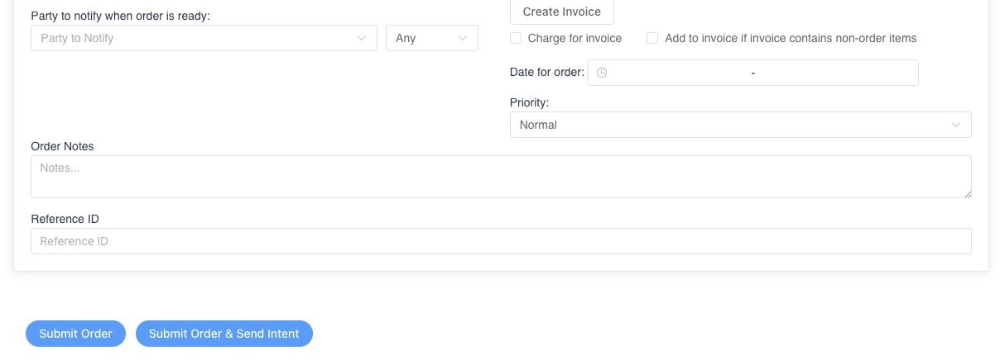

# Create an Order from Prescription Entry

Users can create an order from a prescription entry by checking the option **Add to Order**_._

<figure><figcaption></figcaption></figure>

An order options box with a Create Order button will display on the right side of the page once 'Add to Orde&#x72;_'_ has been selected.

<figure><figcaption></figcaption></figure>

Once **Create Order** is selected, the Manage Order screen will display as a side window. The user will fill out the order options.

* After filling out the order options, close out of the order by clicking the **X** at the top right of the manage order screen or hitting the **Esc** key. The order option selections will now display on the prescription entry. The order with the order options selected will be created upon saving the prescription entry as in-process or ready for verification.
* Continue typing remaining prescriptions, if any. The 'Add to Order' checkbox will stay checked off and any remaining prescriptions will be added to the order.

<figure><figcaption></figcaption></figure>

<figure><figcaption></figcaption></figure>
