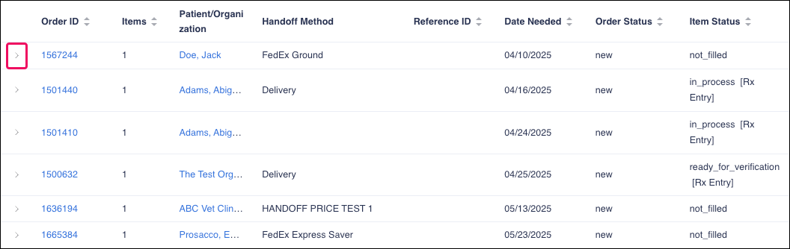

# Using the Orders Queue

The **Orders Queue** shows all created orders. Users can filter orders and see the status of each order.

<figure><figcaption></figcaption></figure>

Click on the arrow next to the order number to show more details about the order.

<figure><figcaption></figcaption></figure>

Users can also create a new order by clicking the **New Order** button. For more information about creating a new order, refer to the [New Order](new-order/) topic.

<figure><figcaption></figcaption></figure>
