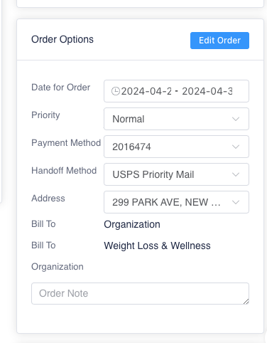
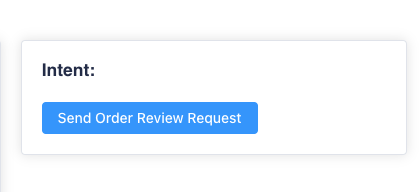

# Submit Order and Send Intent

### From Prescription Entry

* Once the last prescription on the New Prescription task has been entered, mark the task ready for verification and **Save**. The user can then go into the order from the prescription entry by clicking on **Create Order**, scrolling down to Submit Order and **Submit Order & Send Intent**.
  * **Note:** Only click **Submit Order** or **Submit Order & Send Intent** once all prescriptions have been added to the order.
* If the user selects Submit Order & Send Intent, the order will update to show that an intent has been sent.

### From Prescription Entry Verification

* The intent can also be sent from prescription entry verification. In prescription entry verification, the blue button will change to **Edit Order**. Once selected, the manage order screen will display as a side window. The pharmacist can verify all information filled out in the order and select **Submit Order & Send Intent** or **Send Order Review Request.**
  * If an Intent was sent to the patient in prescription entry, this will display on the order in prescription entry verification.

<figure><figcaption></figcaption></figure> <figure><figcaption></figcaption></figure>

<figure><figcaption></figcaption></figure>

<figure><figcaption></figcaption></figure>
