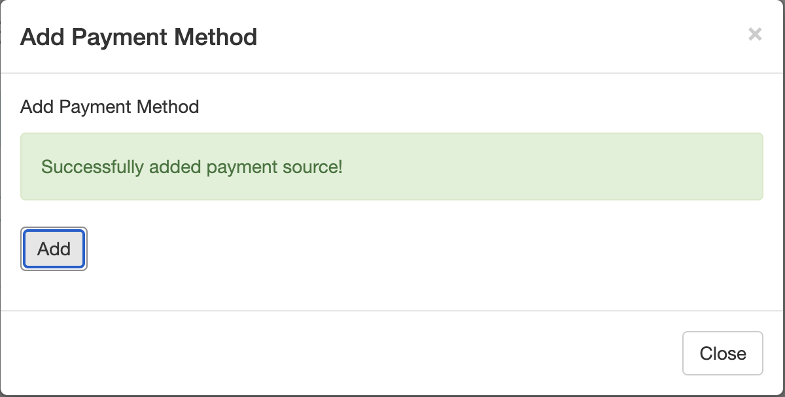

# Emailing a Payment Link

Patients will receive an email with the subject "Payment Method Update" from the pharmacy’s general email.

<figure><figcaption></figcaption></figure>

Patient will click on the link to open up a web browser site, then on **Add Payment Method**_._ Patients can toggle on/off if the card is a FSA/HSA, and if they want the card to be their primary payment option.

<figure><figcaption></figcaption></figure>

Patient will fill out all the information needed then click **Add**. They will then get a notification confirming that the payment has been successfully added.

<figure><figcaption></figcaption></figure> <figure><figcaption></figcaption></figure>

