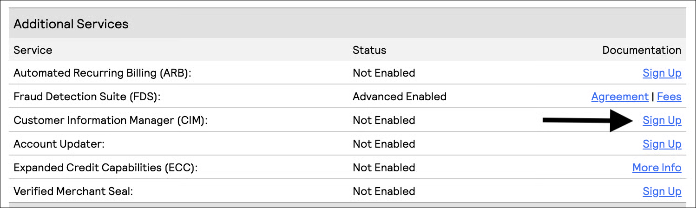

# Setting Up Authorize.net

To get started, log into your [login.authorize.net](https://www.google.com/url?q=http://login.authorize.net\&sa=D\&source=editors\&ust=1718731139375217\&usg=AOvVaw32ABl2sKAPRZrucfhii7KR) account. Under the account section, follow the steps below.

<figure><figcaption></figcaption></figure>

## Configure Settings

Go to **Account > Settings > Fraud Settings > Enhanced Card Code Verification**, and update settings to the following configuration:

<figure><figcaption></figcaption></figure>

Next, go to **Account > Settings > Fraud Settings > Enhanced Address Verification Service** and update settings to the following configuration:

<figure><figcaption></figcaption></figure>

Go to **Account > Merchant Profile > Additional Services > Customer Information Manager (CIM)**, and click **Sign Up** to Enable the CIM.

<figure><figcaption></figcaption></figure>

After signing the agreement on the next page, you will be taken directly to the **Customer Information Manager.**


You do not need to do any additional steps within the CIM. You can move on to the next step (Create API Key) in this guide.


<figure><figcaption></figcaption></figure>

## Create API Key

Go to **Account > Settings > General Security Settings > API Credentials & Keys** and create a **New Transaction Key.**

<figure><figcaption></figcaption></figure>

After you Create a New Transaction Key by hitting the **Submit** button, copy and paste this key immediately into a separate document.


After you hit **Continue** from this screen, you can no longer see the Transaction Key again.


## Provide Pharmetika With the Following From Your Account:

* API Login ID
  * **Example:** 8xT0A7rzx
* Transaction Key
  * **Example:** 123Pbp7qFJaqY81T
