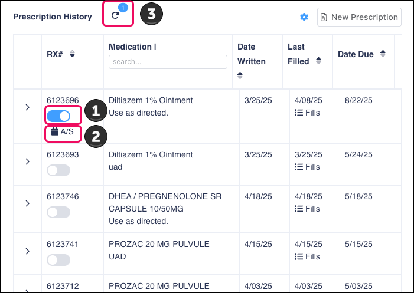

# Automatically Shipping Refills to Patients

If a patient would like to have their refills automatically shipped to them at regular intervals, you can set up this functionality by completing these steps:

1. In the **Profile Options** section of the patient's profile, toggle the patient-level **AutoShip** button on.

<figure><figcaption></figcaption></figure>


It’s important to toggle this setting at the patient level as well as for individual prescriptions. Toggling the setting in the patient profile is what determines whether patients appear on certain autoship reports, such as the **Autoship Patients Without A/S Rxs** report.


2. In the **Patient Summary**, toggle the prescription-level autoship button (1) on for each prescription you want to enable for autoship. When autoship is enabled for a prescription, the **A/S** icon appears (2) and the prescription is added to the autoship counter (3) at the top of the **Prescription History** section.

<figure><figcaption></figcaption></figure>

## Manually Updating the Due Date for a Replacement Autoship Shipment


Use these steps only when creating a replacement autoship shipment which should not be included in the days’ supply count. If you are sending an autoship shipment early, we recommend reviewing the Autoship Calendar activity further in the future.


If you need to manually update a prescription’s next due date, complete these steps:

1. In the **Patient Summary**, click the **A/S** icon for the prescription you want to update.
2. In the **Update Autoship Options** window, select the **Mark for Hold** checkbox.
3. Update the date in the field below the **Autoship Options** heading.&#x20;
4. Click the **Count Day Supply Beginning** field to make it editable and update the date in this field to match the date you entered in step 2.

<figure><figcaption></figcaption></figure>

## Adding Autoship Notes

You can add autoship notes with important information about a patient’s autoship plan. There are four types of autoship notes:\

* **Rx-level:** These notes are linked to the prescription number and are visible only within the Update Autoship Options window.
* **Patient-level:** These notes are linked to the patient and appear in both the Update Autoship Options window and the Notes section in the Patient Summary.&#x20;
* **Rx-level Priority:** An rx-level note that also appears in the Autoship Queue.
* **Patient-level Priority:** A patient-level note that also appears in the Autoship Queue.

To add or edit these notes, complete these steps:

1. In the Patient Summary, click the **A/S** icon for the prescription you want to update.
2. In the **Update Autoship Options** window, enter your note in the **Autoship Notes** section.
3. Select a note type from the arrow’s dropdown menu.
4. Click **Add a Rx-level/Patient-level Priority Note** to add the note.
5. To review all the patient’s notes, click the **View Notes** button.

<figure><figcaption></figcaption></figure>

## Setting the Delivery Date

Sometimes a patient might have a specific date when they want to receive a prescription. For example, they might confirm with you that they will be at home on October 5 to receive a prescription that must be refrigerated immediately. To configure the autoship to have the prescription arrive on a specific date:

1. In the Patient Summary, click the **A/S** icon for the prescription you want to update.
2. In the **Update Autoship Options** window, enter the date you want the prescription to arrive in the **Mark Confirmed for Patient Receipt Date** field.
3. Click the **Confirm** button.

<figure><figcaption></figcaption></figure>


Currently, Pharmetika supports only day supply-based autoship programs. Do not select Nth-day of the Month in the Program field. This option is planned for future support but is not yet ready for use.


## Using the Autoship Queue

Users can manage all upcoming autoship prescriptions using the **Autoship Queue,** which shows a list of all outstanding autoship prescriptions within the selected time range, grouped by patient. From this report, users can refill each autoship prescription with available refills by clicking the **Fill** button.

<figure><figcaption></figcaption></figure>

## Reporting on Autoship Prescriptions

You can use the following reports to see information about medications and patients for whom autoship is enabled:

* **A/S Without Next Fill Dates.** This report shows all medications enabled for autoship without a due date.
* **Autoship - Active Patients.** This report shows all active patients enrolled in autoship.
* **Autoship Patients Without A/S Rxs.** This report shows all active patients enrolled in autoship who do not have active medications marked for autoship.
* **Autoship Refill Authorization Required.** This report shows all active patients enrolled in autoship for whom at least one autoship prescription has no remaining refills. We recommend running this report ten days in advance of each shipment date so that you can contact patients for refill requests, if needed. Your pharmacy can use this report to find autoship medications that need to be authorized by prescribers for refill. To prevent users from faxing prescribers too frequently, the **Last faxed** column shows the last date and time the pharmacy faxed the provider. To automatically fax a refill authorization request to the patient’s prescriber, click the **Send** button in the **Send Fax** column. It is each pharmacy’s responsibility to check the patient’s profile before faxing to make sure the provider did not already complete authorization.
