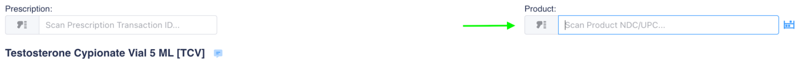

# Dispensing a Prescription

After clicking on a prescription to fill, you can see details about that specific prescription.

<figure><figcaption></figcaption></figure>

.png>): Shows existing lots that are available for use.

.png>)or.png>): Notes for products, patients, and clinics. Will shake <mark style="color:red;">red</mark> first until clicked on.

Users will need to scan the 2D code on the product label in the box.

<figure><figcaption></figcaption></figure>

Details of the scanned product will be displayed and if correct, the user will see a green check mark along with “Product codes match.”

<figure><figcaption></figcaption></figure>

Click **Record & Label** to log that the product has been scanned and to print a prescription label.

<figure><figcaption></figcaption></figure>

<figure><figcaption>
Example of a prescription label.
</figcaption></figure>

Click **Mark Checked** to complete the dispense in order to move fill to the verification queue (PV2).

<figure><figcaption></figcaption></figure>
