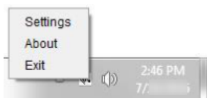
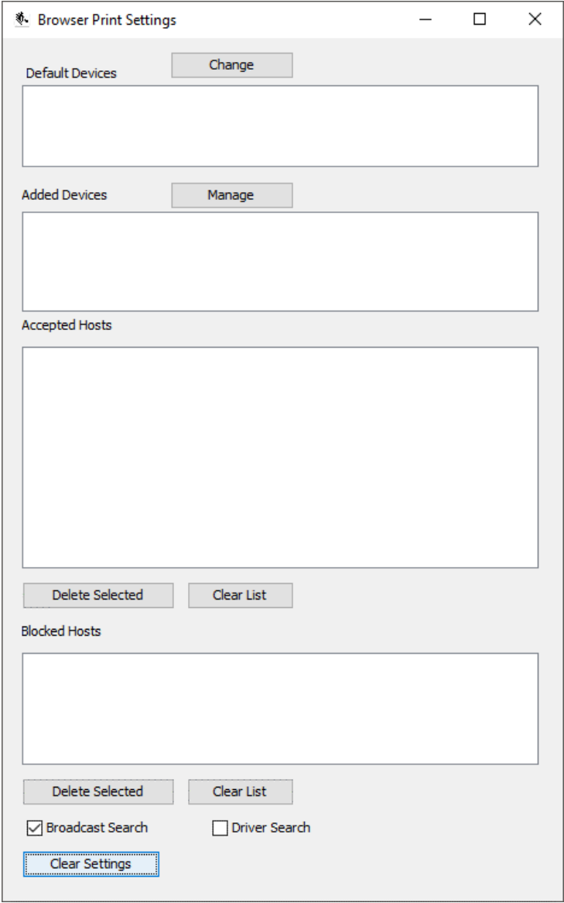
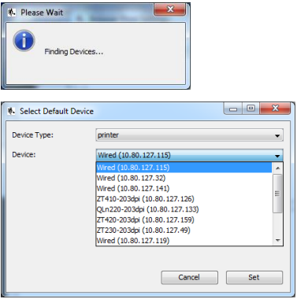
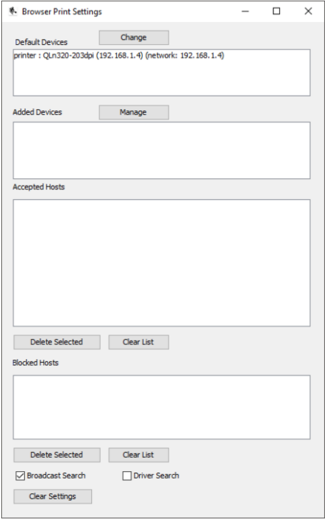
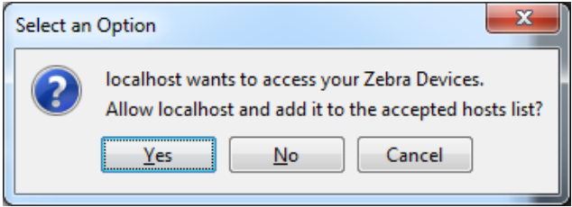

# Adding Printers to BrowserPrint

Right-click (Win) or Click (Mac) on the Zebra log icon and select **Settings**.

<figure><figcaption></figcaption></figure>

To set or change the default printer, click the **Change** button. A pop-up will appear with a dropdown of all discoverable devices (Finding network connected Zebra printers may take a few moments).

<figure><figcaption></figcaption></figure>

<figure><figcaption></figcaption></figure>

Select the device you would like to print to by default and click **Set.**

<figure><figcaption></figcaption></figure>

When using Ion or ElectricLab, you may be prompted to allow the website to access your Zebra Devices. Select **Yes** to allow access.

<figure><figcaption></figcaption></figure>

The website will then be added to the list of **Accepted Hosts** in the BrowserPrint application.

When labels are printed, they will be printed directly to the Zebra printer.
