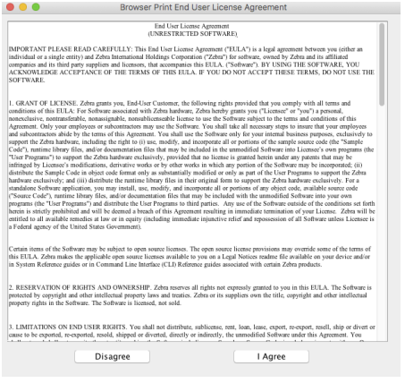
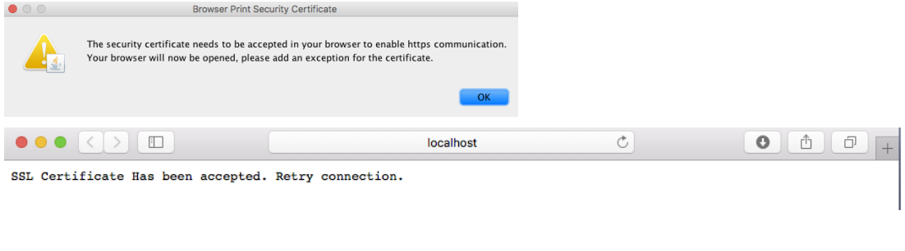
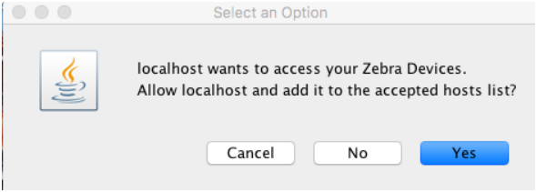
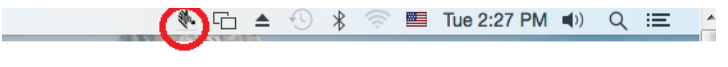

# Installing on MacOS

Open the corresponding install package and drag the Zebra BrowserPrint installation into the **Applications** folder.

<figure><figcaption></figcaption></figure>

Click the **Applications** shortcut to open the applications folder, then double-click the **BrowserPrint** application.

<figure><figcaption></figcaption></figure>

When started for the first time, the End User License Agreement will pop-up. Select **I Agree**.

<figure><figcaption></figcaption></figure>

A pop-up about communicating with a web browser will appear, and the certificate display in the web browser. Click **OK.**

<figure><figcaption></figcaption></figure>

A pop-up will appear requesting access to any connected Zebra devices. Select **Yes**.

<figure><figcaption></figcaption></figure>

A Zebra logo icon will appear in your system tray; this indicates that Zebra BrowserPrint is running.

<figure><figcaption></figcaption></figure>
