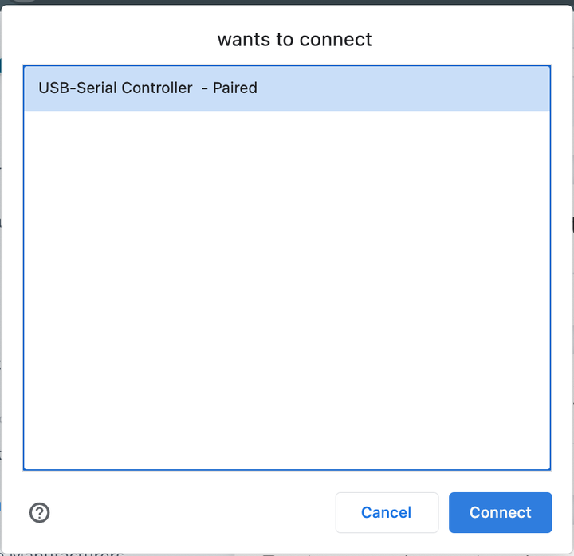

# Local Settings

## Local Devices  


When configuring local devices, it is essential to ensure that printer configurations or browser printing settings are properly and initially set up to ensure smooth and efficient printing operations.


<figure><figcaption></figcaption></figure>

### BrowserPrint 

<figure><figcaption></figcaption></figure>

The DPI settings for browser printing with Zebra should match the printer being used. These settings will impact the image's resolution and zoom level. Verify the printer's DPI and select the setting accordingly.&#x20;


Browserprint must be set up for Zebra printer to apply the DPI settings. Review [Installing Browser Print for Zebra Printers](../supplemental-guides/installing-browserprint/).


### USB Printing

<figure><figcaption></figcaption></figure>

USB printing enables a direct connection between a printer and a user’s computer through a wired setup. Keep in mind that this configuration restricts the printer's usage to the connected computer only. Hardwire the printer to the computer via a USB cable, locate the USB printer type to configure, then click "Connect", locate the printer in the pop up list, and click "Connect" to confirm.

<figure><figcaption></figcaption></figure>

### Network Printing

Network printing is available when printers are not connected through BrowserPrint or via a USB connection. To configure network printing, a transmitter is required, and both the transmitter and the printers must be connected to the same network.


Before using a printer for network printing, ensure it is properly set up in the printer configuration settings. Review [Printer Configurations](system-configurations/printer-configurations.md). Once the printer is set up in printer configurations, this printer will be available in the drop down list for each printer type.&#x20;


<figure><figcaption></figcaption></figure>

Below are the three network printer size options that are available:

* **Fill Label:** 4"x2" label&#x20;
* **Shipping Label:** 4"x6" label&#x20;
* **Full sheet:** 8.5"x11" printer paper
