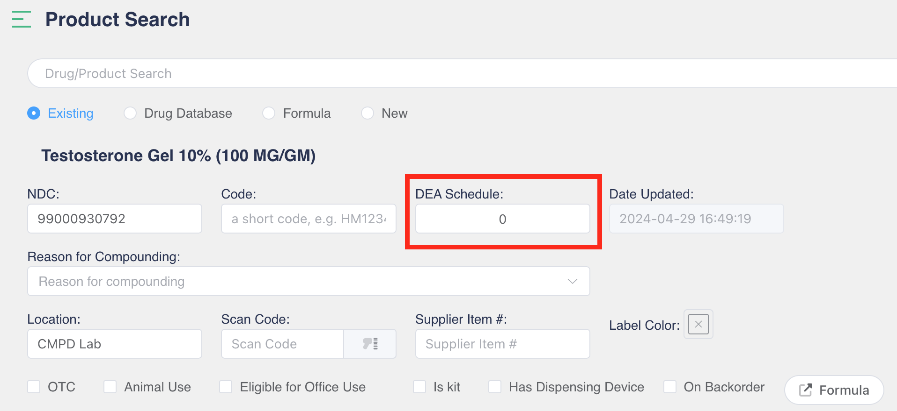
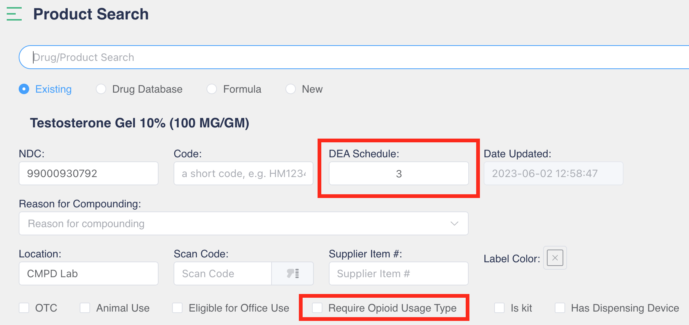
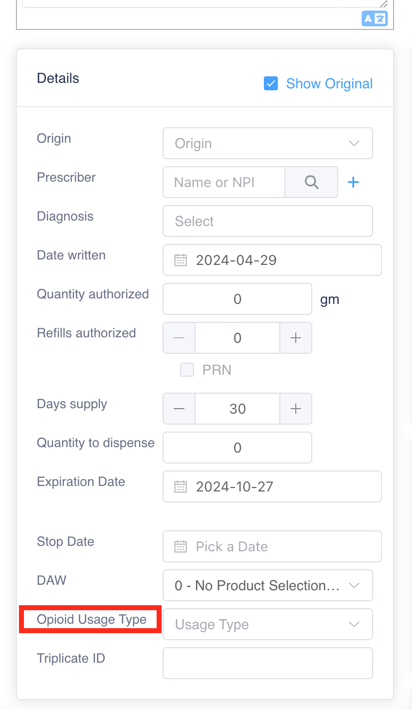
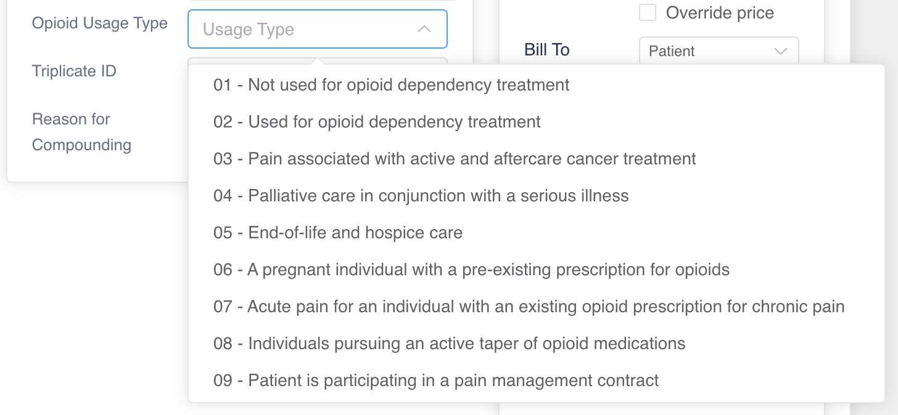

# Enable Opioid Usage Type

Selecting Opioid Usage type in Product will enable a drop-down menu to choose the appropriate type.

## Search Controlled Substance Product on the Product Search Page

<figure><figcaption></figcaption></figure>

First, type in the DEA Schedule for the selected product and then the 'Require Opioid Usage Type' checkbox will appear. After marking the box, save these settings.

<figure><figcaption>
Example: Testosterone Gel 10%, no DEA Schedule
</figcaption></figure> <figure><figcaption>
Example: Testosterone Gel 10%, DEA Schedule 3
</figcaption></figure>

Checking the 'Require Opioid Usage Type' box will enable an **Opioid Usage Type** drop-down list on the patient prescription entry page.

## Patient Prescription Entry Page

Select the Product on the prescription entry page.

<figure><figcaption></figcaption></figure>

Drop-down **Opioid Usage Type** will appear towards the bottom in the 'Detail' box.

<figure><figcaption></figcaption></figure> <figure><figcaption></figcaption></figure>

