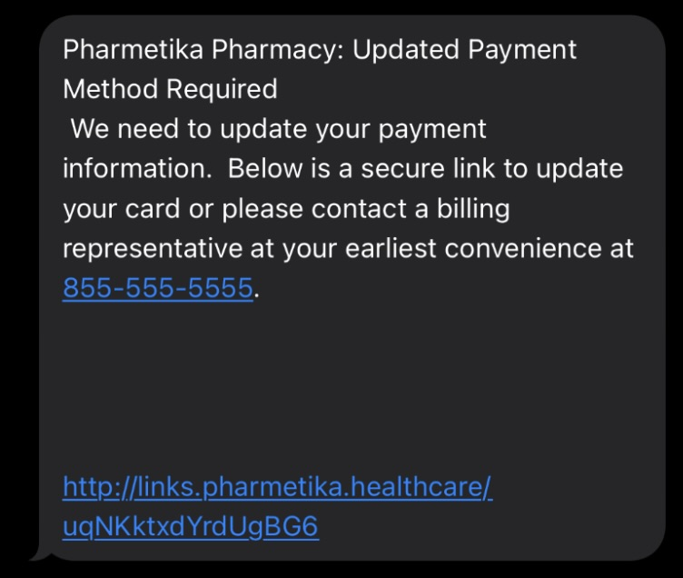
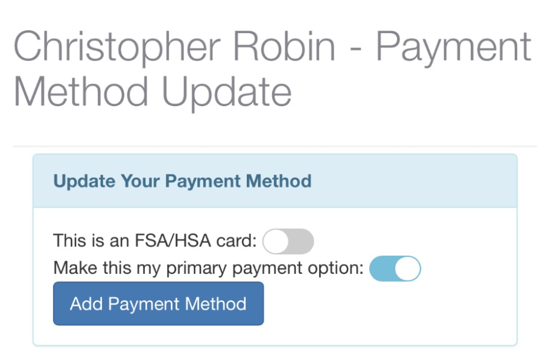
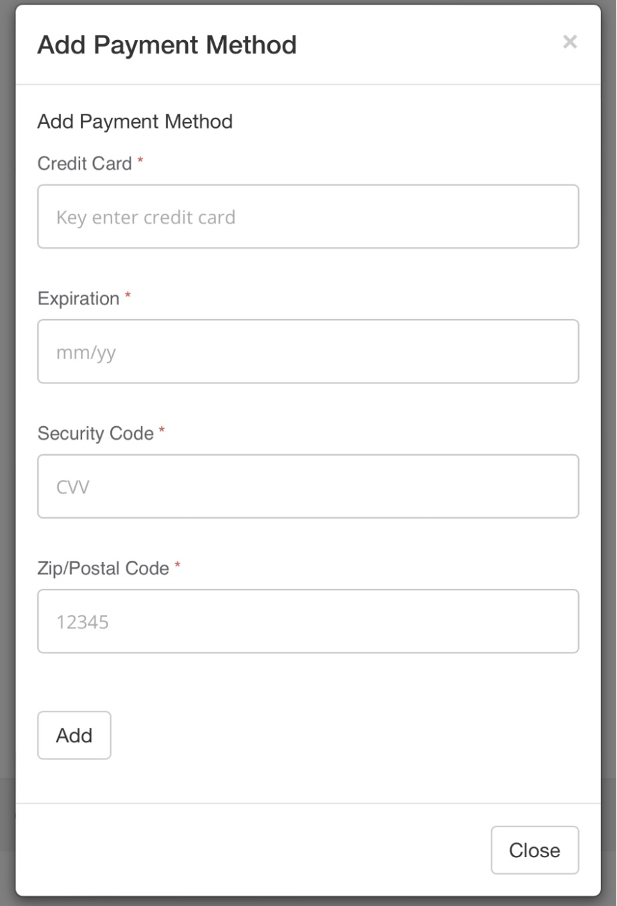
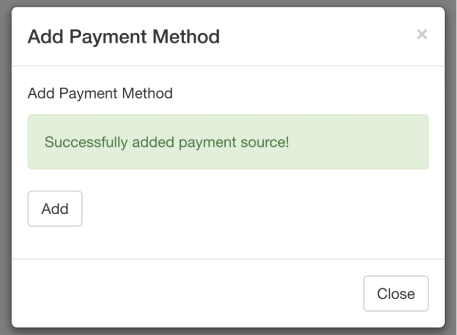

# SMSing a Payment Link

Patients will receive a text message from the pharmacy’s text line like below.

<figure><figcaption></figcaption></figure>

Patient will click on the link to open up a web browser site. Then click on **Add Payment Method**. Patients can toggle on/off if the card is a FSA/HSA, and if they want the card to be their primary payment option.

<figure><figcaption></figcaption></figure>

Patient will fill out all the information needed then click **Add**. They will get a notification confirming that the payment has been successfully added.

<figure><figcaption></figcaption></figure> <figure><figcaption></figcaption></figure>

Once the patient has added the payment method, the pharmacy will receive a task called **Payment Method Update**.

<figure><figcaption></figcaption></figure>

The task will show the patient’s name, a link to the patient’s profile, and any outstanding transactions. Click **Mark Complete** as an acknowledgement the patient has added a payment to their profile.

<figure><figcaption></figcaption></figure>
