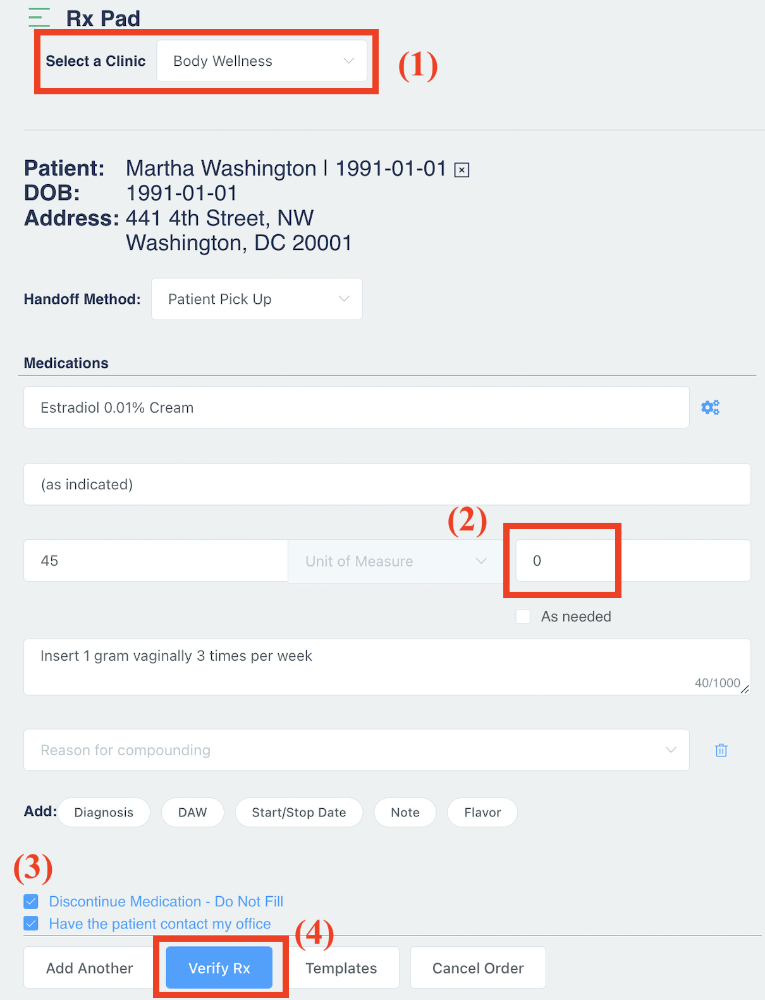
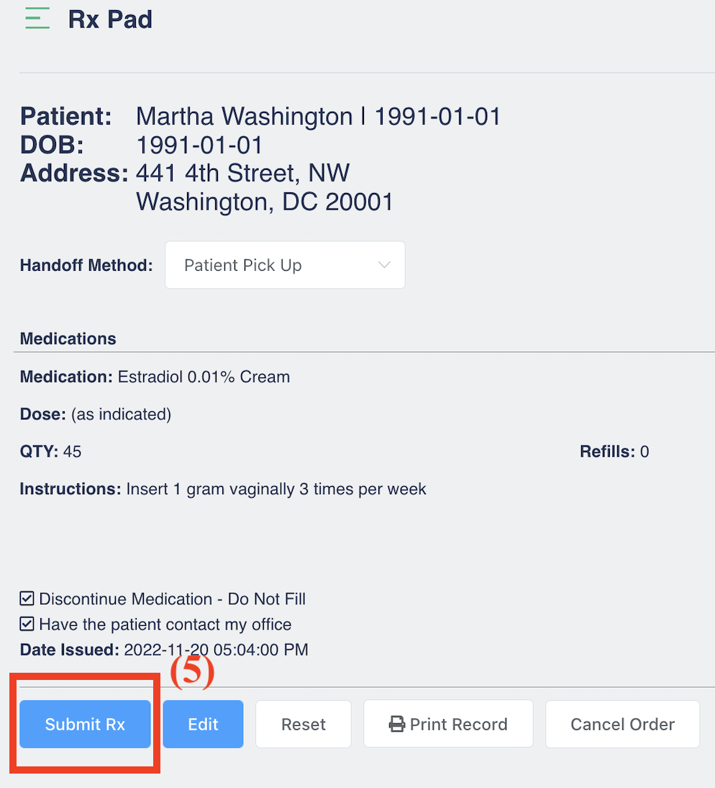

# Patient Refill Requests

## Locating Refill Requests

Refill Requests appear on the **Patient List** page as well as within the **Patient Summary page**. Refills on the Patient List page can be filtered by toggling 'All' or 'Pharmacy requested' on and off.

* **All:** An auto-generated request made after all refills are used on a prescription.
* **Pharmacy Requested:** The patient has asked the pharmacy to request a refill on a prescription.

Selecting a request from the queue enables you to approve or deny the request.

## Approving Refill Requests

Select a clinic from the dropdown.

Enter the amount of refills authorized.

* **Note:** If “0” is entered in the refills field, the request will be sent to the pharmacy as DENIED. See Denying Refill Requests for more information.

Select the **Verify Rx** button to move to the next screen.

Select the **Submit Rx** button to send the refill approval to the pharmacy. This screen also allows you to print a copy for your records if desired.

<figure><figcaption></figcaption></figure> <figure><figcaption></figcaption></figure>

## Denying Refill Requests

Select a Clinic from the dropdown.

Enter ‘0’ in the refills field.

Select any optional messages if desired.

Select the **Verify Rx** button to move to the next screen.

Select the **Submit Rx** button to send the refill denial to the pharmacy. This screen also allows you to print a copy for your records if desired.

<figure><figcaption></figcaption></figure> <figure><figcaption></figcaption></figure>

