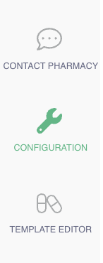

# Webhooks

The webhook configuration option provides UI support for an existing functionality. Users can access this configuration under the portal’s settings to define webhook endpoints and manage integration preferences.

To add a new webhook, go to **Configuration > Webhook Configuration > Add New Webhook Registration.**

<figure><figcaption></figcaption></figure>

<figure><figcaption></figcaption></figure>

<figure><figcaption></figcaption></figure>
