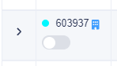
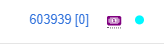

# Workflow Indicator

Prescriptions with a custom workflow will display a colored indicator next to the prescription number in a patient's prescription history and in the dispensing queue. The colored indicator can be changed to any color based on pharmacy preference. This indicator can be filtered for in the dispensing queue.

<figure><figcaption>
Custom workflow indicator as seen in the patient's prescription history.
</figcaption></figure> <figure><figcaption>
Custom workflow indicator as seen in the dispensing queue.
</figcaption></figure>

